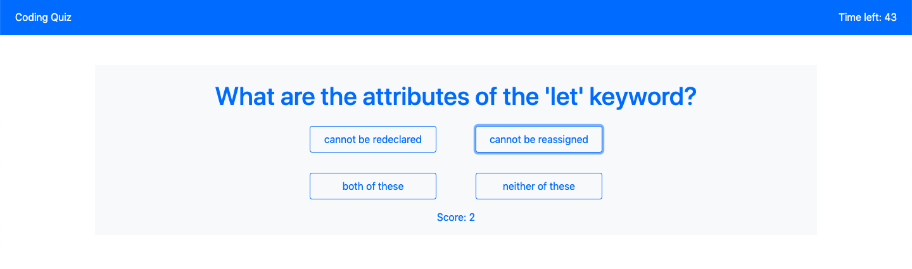
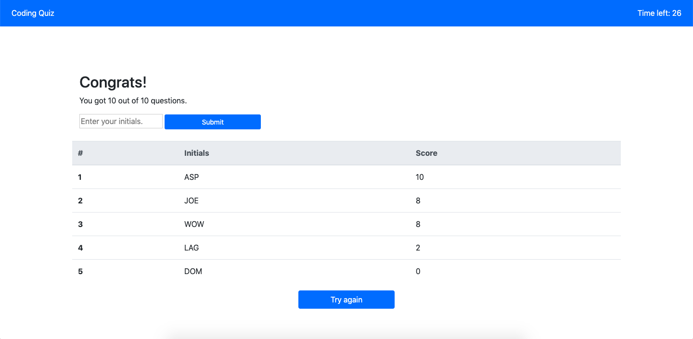

# Coding Quiz

## Functions

- A timer sets the quiz limit to 60 seconds.  The user is presented with a series of coding-related questions.

- At the end, a high score board appears.  The user can enter their initials and it is saved to local storage.

- Upon return, the highscore board will be populated with the top 5 scores from local storage.

## Deployed Application

[Hosted on Github Pages](https://garrettmroberts.github.io/vcb-h4/)

## Example Images

